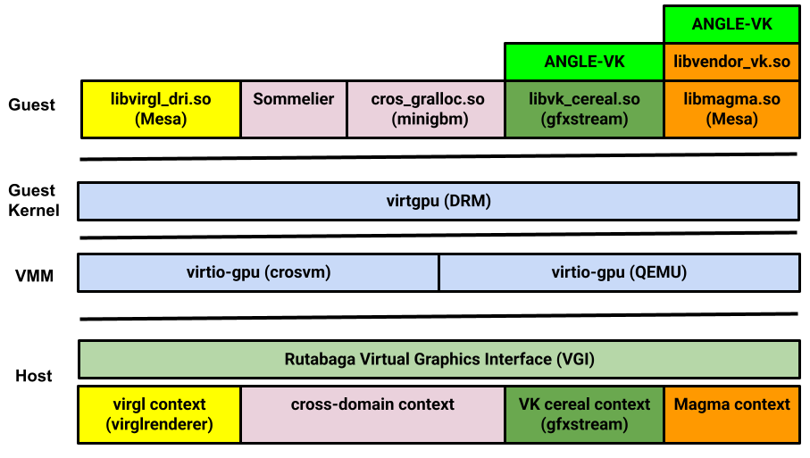

# Rutabaga Virtual Graphics Interface

The Rutabaga Virtual Graphics Interface (VGI) is a cross-platform abstraction for GPU and display
virtualization. The virtio-gpu
[context type](https://www.phoronix.com/news/VirtIO-Linux-5.16-Ctx-Type) feature is used to dispatch
commands between various Rust, C++, and C implementations. The diagram below does not exhaustively
depict all available context types.

<!-- Image from https://goto.google.com/crosvm-rutabaga-diagram -->



## Rust API

Although hosted in the crosvm repository, the Rutabaga VGI is designed to be portable across VMM
implementations. The Rust API is available on [crates.io](https://crates.io/crates/rutabaga_gfx).

## Rutabaga C API

The following documentation shows how to build Rutabaga's C API with gfxstream enabled, which is the
common use case.

### Build dependencies

```sh
sudo apt install libdrm libglm-dev libstb-dev
```

### Build AEMU base

```sh
git clone https://android.googlesource.com/platform/hardware/google/aemu
cd aemu/
cmake -DAEMU_COMMON_GEN_PKGCONFIG=ON \
       -DAEMU_COMMON_BUILD_CONFIG=gfxstream \
       -DENABLE_VKCEREAL_TESTS=OFF -B build
cmake --build build -j
sudo cmake --install build
```

### Build gfxstream

```sh
git clone https://android.googlesource.com/platform/hardware/google/gfxstream
cd gfxstream/
meson setup -Ddefault_library=static build/
meson install -C build
```

### Build FFI bindings to Rutabaga

```sh
cd $(crosvm_dir)/rutabaga_gfx/ffi/
make
sudo make install
```

### Guest-side gfxstream libraries

If your VMM boots to a Linux guest, it's possible to run gfxstream with that.

```sh
git clone https://android.googlesource.com/platform/hardware/google/gfxstream
cd gfxstream/guest
meson setup build/
meson install -C build
```

Headless Vulkan tests (`deqp-vk`, `vulkaninfo`) should work after that.
