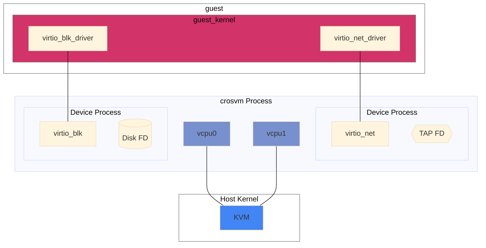

# Sandboxing

Generally speaking, sandboxing is achieved in crosvm by isolating each virtualized devices into its
own process. A process is always somewhat isolated from another by virtue of being in a different
address space. Depending on the operating system, crosvm will use additional measures to sandbox the
child processes of crosvm by limiting each process to just what it needs to function.

In the example diagram above, the virtio block device exists as a child process of crosvm. It has
been limited to having just the FD needed to access the backing file on the host and has no ability
to open new files. A similar setup exists for other devices like virtio net.
