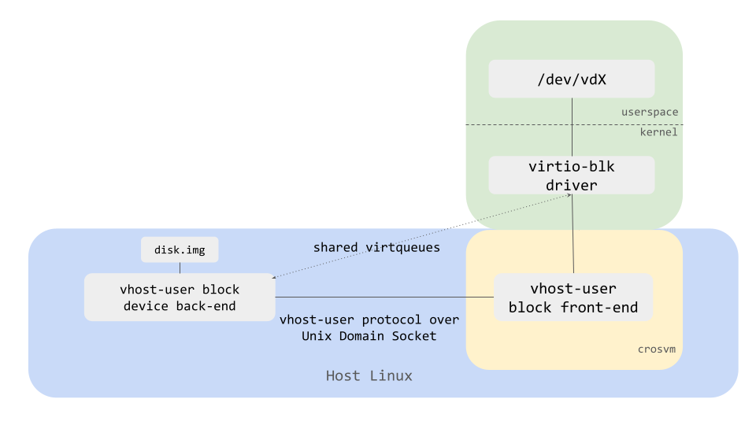

# Vhost-user devices

Crosvm supports [vhost-user] devices for most virtio devices (block, net, etc ) so that device
emulation can be done outside of the main vmm process.

Here is a diagram showing how vhost-user block device back-end and a vhost-user block front-end in
crosvm VMM work together.

<!-- Image from https://docs.google.com/presentation/d/1s6wH5L_F8NNiXls5UgWbD34jtBmijoZuiyLu76Fc2NM/edit#slide=id.ge5067b4ec2_0_55 -->



## How to run

Let's take a block device as an example and see how to start vhost-user devices.

First, start vhost-user block backend with `crosvm device` command, which waits for a vmm process
connecting to the socket.

```sh
# One-time commands to create a disk image.
fallocate -l 1G disk.img
mkfs.ext4 disk.img

VHOST_USER_SOCK=/tmp/vhost-user.socket

# Start vhost-user block backend listening on $VHOST_USER_SOCK
crosvm device block \
  --socket "${VHOST_USER_SOCK}" \
  --file disk.img
```

Then, open another terminal and start a vmm process with `--vhost-user-blk` flag.

```sh
crosvm run \
  --vhost-user-blk "${VHOST_USER_SOCK}" \
  <usual crosvm arguments>
  vmlinux
```

As a result, `disk.img` should be exposed as `/dev/vda` just like with `--block disk.img`.

[vhost-user]: https://qemu.readthedocs.io/en/latest/interop/vhost-user.html
