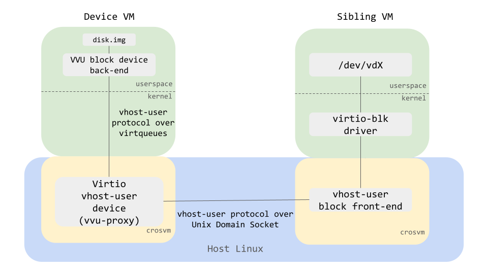

# Virtio Vhost-User device (VVU)

Crosvm also supports the [virtio vhost-user (VVU)] device to run a vhost-user device back-end inside
of another VM's guest. The following diagram shows how VVU works for virtio-block.

<!-- Image from https://docs.google.com/presentation/d/1s6wH5L_F8NNiXls5UgWbD34jtBmijoZuiyLu76Fc2NM/edit#slide=id.g12aad4d534e_0_4 -->



The "virtio vhost-user device", which is also called "vvu-proxy", is a virtio PCI device that works
as a proxy of vhost-user messages between the vhost-user device back-end in the guest of a VM
(device VM) and the vhost-user front-end in another VM (sibling VM).

## How to run

Let's take a block device as an example and see how to start VVU devices.

First, start a device VM with a usual `crosvm run` command. At this time, put a crosvm binary in the
guest in some way. (e.g. putting it in a disk, sharing the host's crosvm with virtiofs, building
crosvm in the guest, etc). Also, make sure that the guest kernel is configured properly with virtio
and vfio features enabled (see [caveat](#Caveats)).

```sh
# On the host.

VHOST_USER_SOCK=/tmp/vhost-user.socket

# Specify the PCI address that the VVU proxy device will be allocated.
# If you don't pass `addr=` as an argument of `--vvu-proxy` below, crosvm will
# allocate it to the first available address.
VVU_PCI_ADDR="0000:00:10.0"

# Start the device VM with '-p "vfio_iommu_type1.allow_unsafe_interrupts=1"'.
crosvm run \
  --vvu-proxy "${VHOST_USER_SOCK},addr=${VVU_PCI_ADDR}" \
  -p "vfio_iommu_type1.allow_unsafe_interrupts=1" \
  -m 4096 \ # Make sure that the device kernel has enough memory to be used
  ... # usual crosvm args
  /path/to/bzImage
```

Then you can check that the VVU proxy device is allocated at the specified address by running
`lspci` in the guest.

```sh
# Inside of the device VM guest.

lspci -s $VVU_PCI_ADDR
# Expected output:
# > 00:10.0 Unclassified device [00ff]: Red Hat, Inc. Device 107d (rev 01)
# '107d' is the device ID for the VVU proxy device.
```

After that you need to make sure that the VVU device is bound to vfio_pci driver by manipulating
sysfs.

```sh
# Inside of the device VM guest.
basename `readlink /sys/bus/pci/devices/$VVU_PCI_ADDR/driver`
# If that shows vfio-pci you are done, otherwise you need to rebind
# the device to the right driver.
echo "vfio-pci" > /sys/bus/pci/devices/$VVU_PCI_ADDR/driver_override
echo "$VVU_PCI_ADDR" > /sys/bus/pci/devices/$VVU_PCI_ADDR/driver/unbind
echo "$VVU_PCI_ADDR" > /sys/bus/pci/drivers/vfio-pci/bind
basename `readlink /sys/bus/pci/devices/$VVU_PCI_ADDR/driver`
# This should show "vfio-pci" now.
```

Then, start a VVU block device backend in the guest that you just started. Although the command
`crosvm device` is the same as [vhost-user's example](./vhost_user.md), you need to use the `--vfio`
flag instead of the `--socket` flag.

```sh
# Inside of the device VM guest.

crosvm device block \
  --vfio ${VVU_PCI_ADDR} \
  --file disk.img
```

Finally, open another terminal and start a vmm process with `--vhost-user-blk` flag on the host. The
current implementation of crosvm only allows a sibling VM to have a smaller memory size than the
device VM, so make sure to specify the memory size correctly.

```sh
# On the host, start a sibling VM. This can be done in the same way as the vhost-user block front-end.

crosvm run \
  --vhost-user-blk ${VHOST_USER_SOCK} \
  -m 512 \ # Make sure that the sibling VM does not have same or more memory than the device VM
  ... # usual crosvm args
  /path/to/bzImage
```

As a result, `disk.img` in the device VM should be exposed as `/dev/vda` in the guest of the sibling
VM.

## Caveats

- In order to use the VVU feature, the Device VM kernel is required to be configured with couple of
  vfio features. Note that the name of the config may vary depending on the version of the kernel.
  We expect that the readers follow the instructions in
  [this page](../running_crosvm/custom_kernel_rootfs.md) to create a custom kernel. In addition to
  the instruction, the required configurations in the Linux Kernel version 5.10 are:

  - CONFIG_ACPI
  - CONFIG_VFIO
  - CONFIG_VFIO_PCI
  - CONFIG_VIRTIO_IOMMU

- Currently, the sibling VM is required to have less memory than the device VM. Make sure that the
  memory size is explicitly defined when starting the VM for both device and sibling VMs.

[virtio vhost-user (vvu)]: https://wiki.qemu.org/Features/VirtioVhostUser
