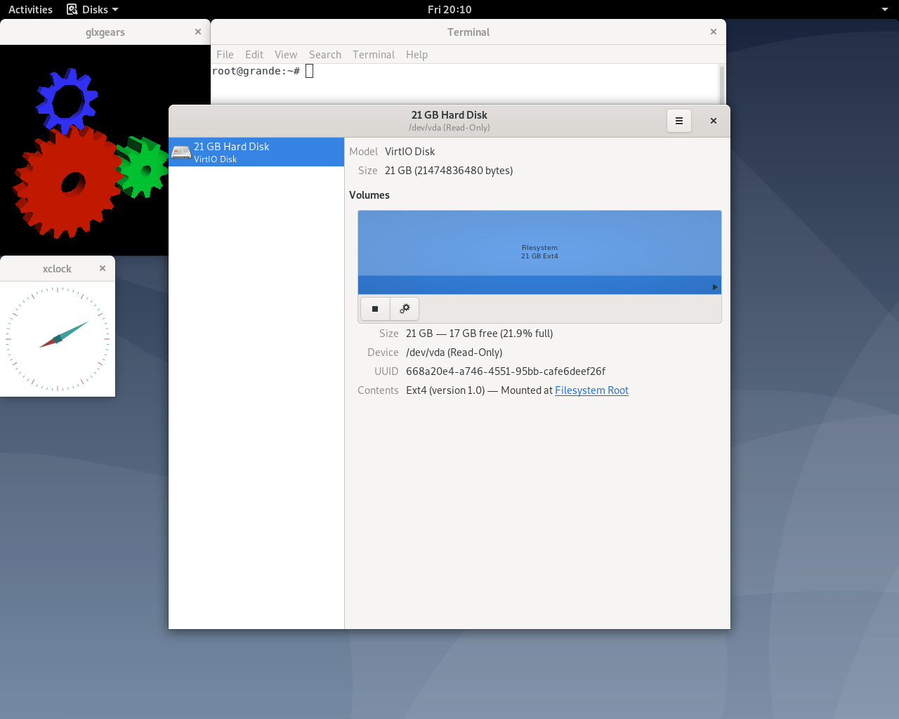

# Example Usage



## Overview

This guide shows how to use crosvm in a x86_64 workstation style environment. The result will make
it possible to use crosvm like one might use QEMU or VirtualBox on the desktop.

## Setup

Building crosvm can be done easily with Docker or in a chromium os chroot. To build in the chroot:

```
cargo build --features="gpu,x"
```

This will build an ordinary binary under the target directory like any other Rust program.
To build using docker:

```
docker/build_crosvm_base.sh
docker/build_crosvm.sh
```

The first docker command just builds a base image and only needs to be run once initially, and then
only rerun if a dependency needs to get updated. The second command builds an image with crosvm
built inside of it. Take note that the crosvm image will have the current UID and GID built into it
so that bind mounted files will be accessible later on.

## Get a Kernel

Because crosvm usually runs the latest stable Chrome OS kernel, that is the most convenient one to
use. If you are using the chroot, you already have the kernel source. Otherwise, you can clone it:

```
git clone --depth 1 -b chromeos-4.19 https://chromium.googlesource.com/chromiumos/third_party/kernel
```

Either way that you get the kernel, the next steps are to configure and build the bzImage:

```
make chromiumos-container-vm-x86_64_defconfig
make menuconfig # use this to set CONFIG_VT=y,CONFIG_INPUT=y,CONFIG_VIRTIO_INPUT=y,CONFIG_INPUT_EVDEV=y
make -j$(nproc) bzImage
```

This kernel does not build any modules, nor does it support loading them, so there is no need to
worry about an initramfs, although they are supported in crosvm.

## Make a rootfs

This stage enjoys the most flexibility. There aren't any special requirements for a rootfs in
crosvm, but you will at a minimum need an init binary. This could even be `/bin/bash` if that is
enough for your purposes. To get you started, a Debian rootfs can be created with debootstrap. Make
sure to define `$CHROOT_PATH`.

```
truncate -s 20G debian.ext4
mkfs.ext4 debian.ext4
mkdir -p "${CHROOT_PATH}"
sudo mount debian.ext4 "${CHROOT_PATH}"
sudo debootstrap stable "${CHROOT_PATH}" http://deb.debian.org/debian/
sudo chroot "${CHROOT_PATH}"
passwd
mount sysfs -t sysfs /sys
apt-get install task-gnome-desktop
rm /etc/systemd/system/display-manager.service
umount /sys
echo "tmpfs /tmp tmpfs defaults 0 0" >> /etc/fstab
echo "tmpfs /var/log tmpfs defaults 0 0" >> /etc/fstab
echo "tmpfs /root tmpfs defaults 0 0" >> /etc/fstab
echo "sysfs /sys sysfs defaults 0 0" >> /etc/fstab
echo "proc /proc proc defaults 0 0" >> /etc/fstab
exit
sudo umount "${CHROOT_PATH}"
```

Networking `todo(smbarber)`

## new ip commands     
    
```
sudo sysctl net.ipv4.ip_forward=1
sudo iptables -t nat  -A POSTROUTING -o eth0 -j MASQUERADE        
sudo /sbin/iptables -A FORWARD -i eth0 -o vmtap0 -m state --state RELATED,ESTABLISHED -j ACCEPT
sudo /sbin/iptables -A FORWARD -o eth0 -i vmtap0 -j ACCEPT
```
       
## run crosvm                    
              
```
sudo ./target/debug/crosvm  run -c 4 -m40000 \
        --host_ip=10.1.1.3 --netmask 255.255.255.0 --mac 70:5a:0f:2f:16:4e \
        --seccomp-policy-dir=seccomp/x86_64 \
        --disk /slowstuff/vm/tatl/vm_rootfs.img \
        --rwdisk /slowstuff/vm_storage.img \
        --rwdisk /slowstuff/test_btrfs.img \
        -p 'init=/bin/bash root=/dev/vda ro debug earlyprintk=/dev/ttyS0' \
        ~/works.vmlinux.bin
```

## Video Acceleration with Nvidia Proprietary Graphics Drivers

If your workstation uses proprietary nvidia graphics and you're using docker, the
docker/build_crosvm.sh script will download and install the matching graphics driver into the
container. In order for this to work, the `nvidia-smi` command must be available and successfully
display the version installed on your workstation. The nvidia driver in your container must have the
same version as the nvidia driver in your host. Therefore, if you change the version of your host
nvidia driver, you must rerun `docker/build_crosvm.sh`.

## Running a VM

If running inside of docker, the following will run the kernel and rootfs with gpu support:

```
xhost local:root # Required if displaying with X11
docker/crosvm_wrapper.sh run --gpu -c 2 -m 1024 --root "${ROOTFS_PATH}" "${KERNEL_PATH}"
```

Note that the paths given using the wrapper must be relative to the working directory because the
wrapper will only mount the working directory into the container. The equivalent to the above
command if you are using cargo directly:

```
target/debug/crosvm run --gpu -c 2 -m 1024 --root "${ROOTFS_PATH}" "${KERNEL_PATH}"
```

You should then see the initial kernel output sent to stdout via the emulated ttyS0. If you are
using the debian rootfs above, you will see the tty login prompt that you can use to login. Once
logged in, startx will work to start a quick gnome session.
