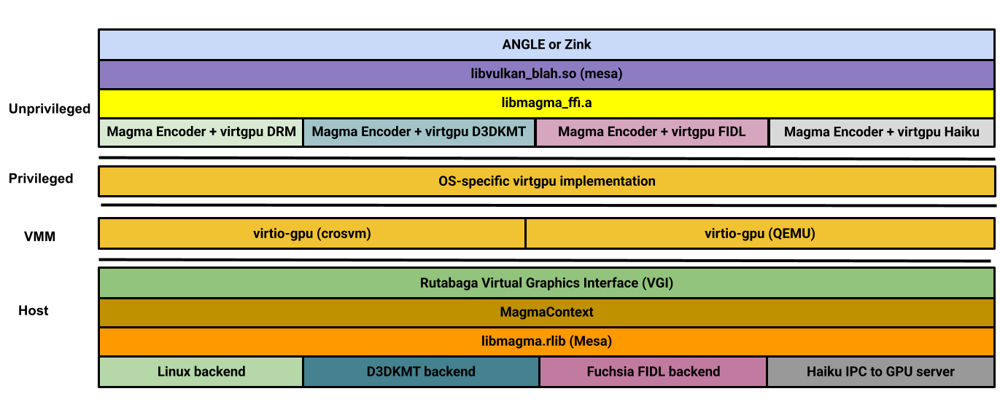

# Rutabaga Virtual Graphics Interface

The Rutabaga Virtual Graphics Interface (VGI) is a cross-platform abstraction for GPU and display
virtualization. The virtio-gpu
[context type](https://www.phoronix.com/news/VirtIO-Linux-5.16-Ctx-Type) feature is used to dispatch
commands between various Rust, C++, and C implementations. The diagram below does not exhaustively
depict all available context types.

<!-- Image from https://goto.google.com/crosvm-rutabaga-diagram -->


## Rust API

Although hosted in the crosvm repository, the Rutabaga VGI is designed to be portable across VMM
implementations. The Rust API is available on [crates.io](https://crates.io/crates/rutabaga_gfx).

## Rutabaga C API

The following documentation shows how to build Rutabaga's C API with gfxstream enabled, which is the
common use case.

### Build dependencies

```sh
sudo apt install libdrm libglm-dev libstb-dev
```

### Install libaemu

```sh
git clone https://android.googlesource.com/platform/hardware/google/aemu
cd aemu/
git checkout v0.1.2-aemu-release
cmake -DAEMU_COMMON_GEN_PKGCONFIG=ON \
       -DAEMU_COMMON_BUILD_CONFIG=gfxstream \
       -DENABLE_VKCEREAL_TESTS=OFF -B build
cmake --build build -j
sudo cmake --install build
```

### Install gfxstream host

```sh
git clone https://android.googlesource.com/platform/hardware/google/gfxstream
cd gfxstream/
meson setup host-build/
meson install -C host-build/
```

### Install FFI bindings to Rutabaga

```sh
cd $(crosvm_dir)/rutabaga_gfx/ffi/
meson setup rutabaga-ffi-build/
meson install -C rutabaga-ffi-build/
```

### Install virglrenderer host

Rutabaga's C API can also be built with virglrenderer enabled. To use virglrenderer feature first
install virglrenderer on the host.

```sh
git clone https://gitlab.freedesktop.org/virgl/virglrenderer.git
cd virglrenderer/
git checkout virglrenderer-1.0.1
meson setup build/
meson install -C build/
```

### Latest releases for potential packaging

- [Rutabaga FFI v0.1.2](https://crates.io/crates/rutabaga_gfx_ffi)
- [gfxstream v0.1.2](https://android.googlesource.com/platform/hardware/google/gfxstream/+/refs/tags/v0.1.2-gfxstream-release)
- [AEMU v0.1.2](https://android.googlesource.com/platform/hardware/google/aemu/+/refs/tags/v0.1.2-aemu-release)
- [virglrenderer v1.0.1](https://gitlab.freedesktop.org/virgl/virglrenderer/-/tree/virglrenderer-1.0.1)

# Kumquat Media Server

The Kumquat Media server provides a way to test virtio multi-media protocols without a virtual
machine. The following example shows how to run GL and Vulkan apps with `virtio-gpu` +
`gfxstream-vulkan`. Full windowing will only work on platforms that support `dma_buf` and
`dma_fence`.

Only headless apps are likely to work on Nvidia, and requires
[this change](https://crrev.com/c/5698371).

## Build GPU-enabled server

First install [libaemu](#install-libaemu) and the [gfxstream-host](#install-gfxstream-host), then:

```sh
cd $(crosvm_dir)/rutabaga_gfx/kumquat/server/
cargo build --features=gfxstream
```

## Build gfxstream guest

Mesa provides gfxstream vulkan guest libraries.

```sh
git clone https://gitlab.freedesktop.org/mesa/mesa.git
cd mesa
meson setup guest-build -Dvulkan-drivers="gfxstream" -Dgallium-drivers="" -Dvirtgpu_kumquat=true -Dopengl=false -Drust_std=2021
ninja -C guest-build/
```

## Run apps

In one terminal:

```sh
cd $(crosvm_dir)/rutabaga_gfx/kumquat/server/
./target/debug/kumquat
```

In another terminal, run:

```sh
export MESA_LOADER_DRIVER_OVERRIDE=zink
export VIRTGPU_KUMQUAT=1
export VK_ICD_FILENAMES=$(mesa_dir)/guest-build/src/gfxstream/guest/vulkan/gfxstream_vk_devenv_icd.x86_64.json
vkcube
```

# Linux guests

To test gfxstream with Debian guests, make sure your display environment is headless.

```
systemctl set-default multi-user.target
```

Build gfxstream guest as previously and start the compositor. The `VIRTGPU_KUMQUAT` variable is no
longer needed:

```sh
export MESA_LOADER_DRIVER_OVERRIDE=zink
export VK_ICD_FILENAMES=$(mesa_dir)/guest-build/src/gfxstream/guest/vulkan/gfxstream_vk_devenv_icd.x86_64.json
weston --backend=drm
```

# Contributing to gfxstream

To contribute to gfxstream without an Android tree:

```sh
git clone https://android.googlesource.com/platform/hardware/google/gfxstream
cd gfxstream/
git commit -a -m blah
git push origin HEAD:refs/for/main
```

The AOSP Gerrit instance will ask for an identity. Follow the instructions, a Google account is
needed.

# Magma

Magma is an effort to standardize GPU system call interfaces, in a way that is optimized for
remoting and microkernels. This takes direct inspiration from the
[Fuchsia Magma interface](https://fuchsia.dev/fuchsia-src/development/graphics/magma): in that
design, the library interface and protocol are OS-agnostic. An OS-specific virtgpu implementation
handles paravirtualization.

Follow along with [Mesa MR](https://gitlab.freedesktop.org/mesa/mesa/-/merge_requests/33190) to see
if it works or we fall flat on our face.

<!-- Image from Mesa MR -->


