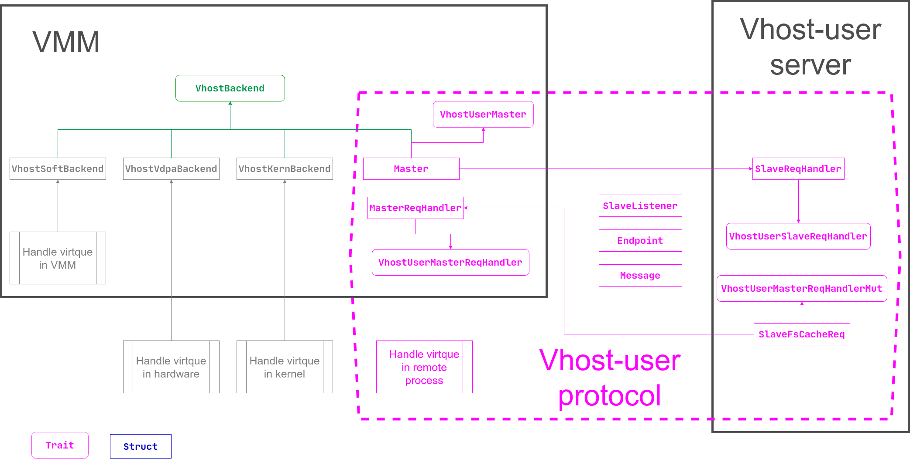

# vHost

A pure rust library for vhost-user. This is a fork of
[rust-vmm/vhost](https://github.com/rust-vmm/vhost).

The
[vhost-user protocol](https://qemu.readthedocs.io/en/latest/interop/vhost-user.html#communication)
aims to implement vhost backend drivers in userspace, which complements the ioctl interface used to
control the vhost implementation in the Linux kernel. It implements the control plane needed to
establish virtqueue sharing with a user space process on the same host. It uses communication over a
Unix domain socket to share file descriptors in the ancillary data of the message.

The protocol defines two sides of the communication, frontend and backend. Frontend is the
application that shares its virtqueues, backend is the consumer of the virtqueues. Frontend and
backend can be either a client (i.e. connecting) or server (listening) in the socket communication.
