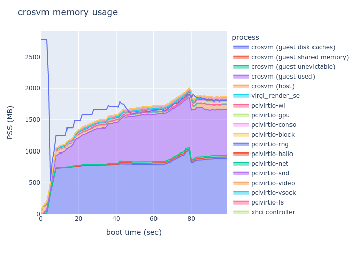

# memstats chart

Gather and visualize memory information of each crosvm process, the guest and virtio-balllon for a
running crosvm instance.

This tool only supports Linux enviroments.



## Usage

## Install dependencies

We need to install some Python libraries for visualization.

```sh
$ pip install -r ./requirements.txt
```

## Build

Build the tool with cargo and copy the binary to the device if necessary.

```sh
$ cd crosvm/tools/contrib/memstats_chart/
$ cargo build --release
# (optional) If crosvm is running on another machine, copy the binary to the machine.
$ scp ./target/release/memstats $DUT:/your/favorite/directory/
```

If you want to run the binary on aarch64 while your workstation is x86, `dev_container` is useful.

```sh
$ ${CROSVM_PATH}/tools/dev_container
(container)$ cd tools/contrib/memstats_chart
(container)$ cargo build --target aarch64-unknown-linux-gnu
(container)$ cp /scratch/cargo_target/aarch64-unknown-linux-gnu/debug/memstats
```

### Collect data

Run the binary. Note that this tool is assuming that only one crosvm is running on the system. If
there are multiple crosvm instances running, this tool will abort.

```sh
$ ./memstats --output memory-data.json
# Press Ctrl-C to stop collecting data
```

### Visualize the data

Visualize the obtained JSON file with `plot.py`.

```sh
$ python3 plot.py -i ./memory-data.json
./memory-data.html is written
$ google-chrome ./memory-data.html
```
