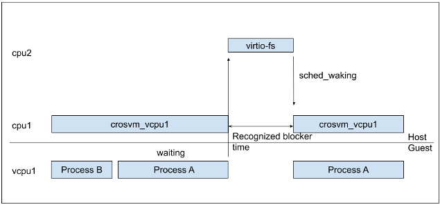
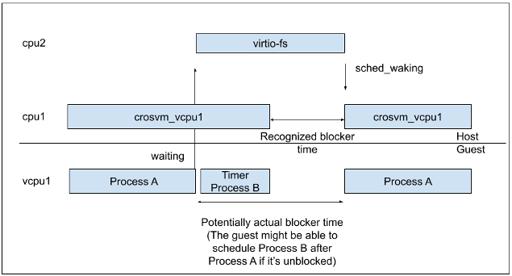

# VCPU process state time analysis tool

This tool helps you analyze what virtio device is likely to be the bottleneck of the given workload
from an output of `trace-cmd report`. This tool analyzes the running time, waiting time, and
preemption time of crosvm's vcpu processes. The running time is the total time crosvm's vcpu
processes run on the host processors, the waiting time is the total time crosvm's vcpu processes
wait for other processes, and the preemption time is the total time crosvm's vcpu processes were
preempted by other processes.

In practice, it means... if the vcpu processes are mostly waiting for the vitio-blk process, the
bottleneck is likely to be the block device. If the vcpu processes are frequently preempted by other
processes, the bottleneck is likely to be the processor performance.



This mechanism is far from perfect due to the defects outlined in the next section. However, it
gives you a gut feeling of the bottleneck virtio-device. It also estimates the time savings of your
workload you can achieve by improving the performance of a virtio device.

## Defect

This tool underestimates the time vcpu processes are waiting for a virtio device. This is due to two
major reasons; timer/periodic interrupts and soft-irq.

This tool calculates the time a virtio device process blocks vcpu processes by accumulating how long
a vcpu process was sleeping when a virtio device wakes up the vcpu process. Thus, if a periodic
interrupt waked up a vcpu process in the middle of the VCPU's sleep, the block time is
underestimated. Similarly, if a device interrupts is handled by some running vcpu and then delivered
to other sleeping vcpu via soft-irq inside the guest, the block time is also underestimated.

On the other hand, this tool can estimate the time savings of your workload by improving the
performance of a virtio device. If we reduce block / preempt time of some virtio-process, that will
always reduce the total time.



## How to run

### 1. Make a `trace.dat` file by `trace-cmd record` for your workload.

This tool requires `sched:*` and `task:task_rename` events from `trace-cmd`.

#### When you run crosvm manually

To make a `trace.dat` file, you can use `trace-cmd record`.

```console
$ trace-cmd record -e sched:* -e task:task_rename -o trace.dat crosvm run ...
```

This will generate `trace.dat` in the current directory.

#### When you run ChromeOS Tast tests

Some ChromeOS Tast tests such as `arc.RegularBoot.boot` have built-in `trace-cmd record` feature.

To get a trace file from `arc.RegularBoot.vm`, you can use `tast run` with
`arc.RegularBoot.traceCmdEvents`. Then you can get `0-trace.dat` in your result directory.

```console
$ tast run -var arc.RegularBoot.traceCmdEvents="task:task_rename,sched:*" $DUT arc.RegularBoot.vm
```

Refer to the source code of your Tast test to see if it supports `traceCmdEvents`.

### 2. Generate the text data via `trace-cmd report`

This tool's input is currently the text data generated by `trace-cmd report`, not `trace.dat`
itself.

```console
$ trace-cmd report trace.dat > trace.txt
```

### 3. Run this tool.

```console
$ cargo run --release -- -i trace.txt
```

## How to read the result

The output of this tool looks like this. This is taken from a trace of `RegularBoot.vm` on a Brya
with some modification. The description of each metric is added in the comments inside parentheses.

From the below, you can read that the majority of VCPU states are sleep, so the workload is not so
processor-heavy on this device, and virtio-blk is the major waker of the VCPU, thus it has an
opportunity to be improved to make the workload faster.

```
(time in seconds by VCPU process state for each VCPU)
vcpu0_running   3.2823 sec      (ratio: 27.913% of vcpu0_time)
vcpu0_sleep     8.1406 sec      (ratio: 69.229% of vcpu0_time)
vcpu0_runnable  0.2446 sec      (ratio: 2.080% of vcpu0_time)
vcpu0_preempted 0.0914 sec      (ratio: 0.778% of vcpu0_time)
---snip---
(That of the total VCPUs instead of each VCPU)
total_vcpu_running      23.3277 sec     (ratio: 25.081% of total_vcpu_time)
total_vcpu_sleep        67.7202 sec     (ratio: 72.810% of total_vcpu_time)
total_vcpu_runnable     1.3776 sec      (ratio: 1.481% of total_vcpu_time)
total_vcpu_preempted    0.5844 sec      (ratio: 0.628% of total_vcpu_time)
total_vcpu_time 93.0099 sec
---snip---
(Total time VCPU processes were waiting for other processes)
blocked_virtio_blk      6.2771 sec      (ratio: 6.749% of total_vcpu_time)
---snip---
blocked_v_fs:_data:1    1.7611 sec      (ratio: 1.893% of total_vcpu_time)
blocked_v_balloon       1.3707 sec      (ratio: 1.474% of total_vcpu_time)
blocked_v_console       0.6851 sec      (ratio: 0.737% of total_vcpu_time)
---snip---
(Total time VCPU processes were preempted by other processes)
(*This is taken from another Octopus data since Brya had little preemption)
preempted_v_fs:_data:1  2.2760 sec      (ratio: 3.179% of total_vcpu_time)
preempted_chrome        1.1027 sec      (ratio: 1.538% of total_vcpu_time)
---snip---
```

From the result above, you can see that virtio-blk is one of the bottleneck of this workload; it
blocks vcpu processes for around 6.3 seconds and preempts 1.6 second.
